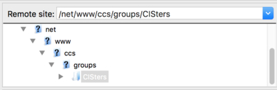

# NUWIT Website
This is the repo for the NU Women in Tech club website. It's hosted on the CCIS servers under
```
/net/www/ccs/groups/CISters
```
with the domain [nuwit.ccs.neu.edu](http://nuwit.ccs.neu.edu).


## Getting started
This site is built on a static site generator called [Jekyll](https://jekyllrb.com/). So first, check out Jekyll's [quick start guide](https://jekyllrb.com/docs/quickstart/) and [installation docs](https://jekyllrb.com/docs/installation/).

After you've installed Jekyll and all its dependences, open up a terminal window and then:

1. `git clone git@github.com:nuwit/website.git nuwit-website`
1. `cd nuwit-website`
1. `bundle install`
1. `jekyll serve` (this command watches for local changes automatically- If this doesn't work, run `bundle exec jekyll serve`)
1. Open up a browser and go to `localhost:4000`

At any point if you find yourself confused about any of the code, [Jekyll docs](https://jekyllrb.com/docs/home/) and google are your best friends.


## Deployment
#### Step 1: Run `jekyll build` (or `bundle exec jekyll build`)

(This will generate a fresh build of the project into the `_site` folder.)

There are several ways you can push files onto the CCIS server, but the easiest way is probably FTP (File Transfer Protocol). If you haven't used an FTP client before, go ahead and download [Filezilla](https://filezilla-project.org/download.php?type=client) or [Cyberduck](https://cyberduck.io/?l=en).

Under site manager, set up your connection to the CCIS server like so:


#### Step 2: Navigate to the CISters directory `/net/www/ccs/groups/CISters`

The easiest way to navigate to that directory is by _**copying and pasting**_ that path into the remote site input like so:



Make sure you _**COPY AND PASTE**_ the path, you won't be able to find the directory by clicking through the folders.


#### Step 3: Drag and drop the files from `_site` into the `CISters` directory

##### Important (!!!) If you drag and drop _everything_ in your directory, you'll break the whole site. The correct files are ONLY the files in the `_site` directory


## Caveats
Since the site is hosted on the CCIS server, there are some hoops you may need to jump through in order to push things to the server for the first time. If at any point you find yourself not being able to change things on the server, you probably don't have the right permissions.

Go ahead and email [systems@ccs.neu.edu](mailto:systems@ccs.neu.edu) and tell them you're on the NU WIT E-Board. They'll be able to give you the right permissions.

Also, for consistency, please use **2 spaces** (NOT tabs, NOT 4 spaces) for indentation!!!
